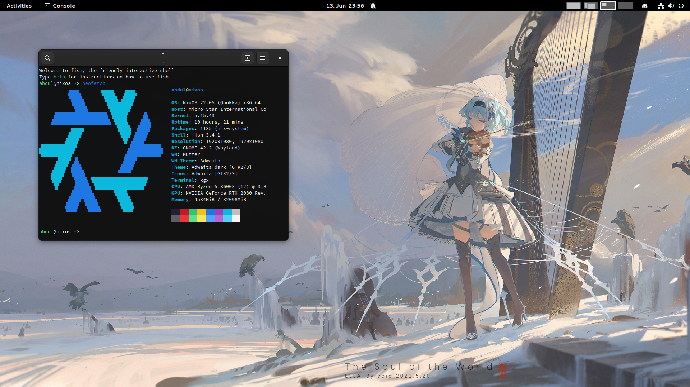

### Sysconf
My modular nixos configuration and dotfiles.

##### Workstation config screenshot


#### Installation
Configuration can be installed by running
```
# ./install_config
# nixos-rebuild switch 
```
