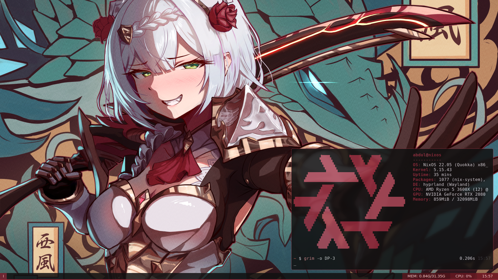

### Sysconf
My modular nixos configuration and dotfiles.

##### Screenshot


#### Installation
Configuration can be installed by running
```
$ git clone https://github.com/abdul2906/sysconf.git
$ cd sysconf/
# ./install_config
# nixos-rebuild switch 
```

#### Missing configuration:
- [ ] GTK Themes
- [ ] Firefox CSS
- [ ] Fish shell
